# Heapsort
O Heapsort é um algoritmo de ordenação desenvolvido por Robert W. Floyd e J.W.J. Williams em 1964. O Heapsort faz uso de uma estrutura de dados conhecida como **Heap Binário** para gerenciar informações durante a execução do algoritmo. O algoritmo Heapsort é semelhante à seleção, no qual primeiro encontramos o maior elemento e colocamos no final [1]. Repetindo o mesmo processo para os elementos restantes, temos o vetor final ordenado. O segredo do heapsort está na forma de estruturar seus dados de uma maneira que esta busca pelo maior elemento se torne mais simples, comparado aos outros algoritmos de seleção.

## Heap Binário
A estrutura de dados **Heap Binário** é um objeto arranjo que pode ser visualizado como uma árvore binária. Os valores são armazenados numa ordem especial, de modo que o nó pai é maior (*Heap máximo*) ou menor (*Heap mínimo*) que os seus dois filhos [2]. Para o algoritmo de Heapsort, utilizamos o _heap máximo_. Cada nó da árvore binária possui sua representação no arranjo. Um arranjo `A` que representa um heap é um objeto com dois atributos:

- `comprimento[A]`: Corresponde ao número de elementos no arranjo `A`
- `tamanho-do-heap[A]`: Corresponde ao número de elementos no heap armazenado dentro do arranjo `A`

É importante ressaltar que `A[1..comprimento[A]]` pode conter números válidos, porém nenhum elemento além de `A[tamanho-do-heap[A]]`, onde `tamanho-do-heap[A] <= comprimento[A]`, é um elemento do **heap**.

<figure class="image">
  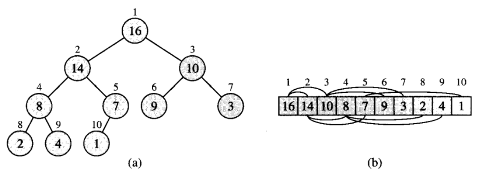
  <figcaption>Figura 1: a) árvore em heap máximo; b) vetor correspondente. Fonte: CORMEN et al. [1]</figcaption>
</figure>

A raiz da árvore binária é representada pelo primeiro elemento, ou seja `A[1]`. A partir de um índice `i` de um nó, os índices de seu pai `PARENT(i)` e dos seus filhos da esquerda e da direita, respectivamente `LEFT(i)` e `RIGHT(i)`, podem ser computados de forma simples e direta:

- `PARENT(i) = i / 2`
- `LEFT(i) = 2i + 1`
- `RIGHT(i) = 2i + 2`

# Algoritmo Heapsort

O algoritmo do Heapsort funciona em 3 etapas:

1. Transformar um vetor `A` desordenado de `N` elementos para o estado de _heap_ máximo
2. Como o vetor está em estado de _heap_ máximo, o maior item é armazenado na raiz do heap, ou seja,`A[1]`. Substitua-o pelo último item do _heap_ seguido pela redução do tamanho do _heap_ por 1. Finalmente, monte a raiz da árvore.
3. Repita as etapas acima enquanto o tamanho do _heap_ for maior que 1.

# Sub-rotinas

## MAX-HEAPIFY
MAX-HEAPIFY é uma sub-rotina utilizada para manipulação de _heaps_ máximos. Sua principal função é deixar que o valor em `A[i]` "flutue para baixo" no _heap_ máximo para que a subárvore com raiz no índice `i` se torne um _heap_ máximo, ou seja `A[PARENT(i)] <= A[i]`.

### Pseudocódigo

<figure class="image">
  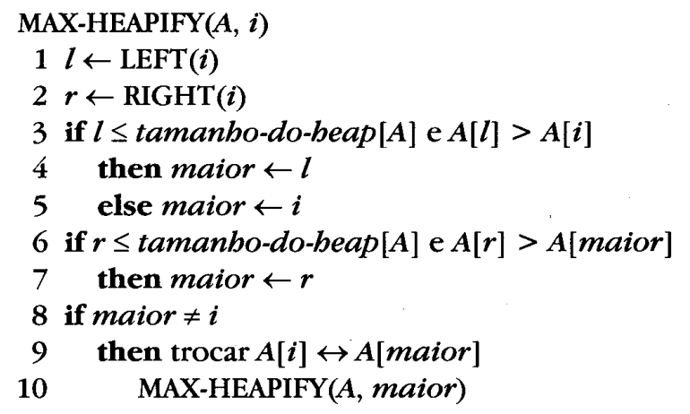
  <figcaption>Figura 2: Pseudocódigo MAX-HEAPIFY. Fonte: CORMEN et al. [1]</figcaption>
</figure>

### Análise da Complexidade
De forma direta, podemos perceber que a complexidade do MAX-HEAPIFY está em função da altura `h` da árvore. Para o pior caso temos que o nó raiz contém o menor valor da árvore e com isso será preciso `h` substituições para que a árvore esteja em estado de _heap máximo_, por tanto complexidade `O(h)`. Como estamos lidando com uma estrutura de dados de árvore binária quase completa, sua altura máxima é `lg(n)`, no qual `n` é o número de nós da árvore. Portanto, a complexidade é igual a `O(lg n)`.

Outra forma de analisarmos a complexidade é percebendo que o tempo de execução de MAX-HEAPIFY em uma subárvore de tamanho `n` com raiz em um dado nó `i` é o tempo `Θ(1)` para corrigir os relacionamentos entre os elementos `A[i]`, `A[LEFT(i)]`, `A[RIGHT(i)]`, somado com o tempo para executar MAX-HEAPIFY recursivamente em uma subárvore com raiz em um dos filhos do nó `i`. As subárvores de cada filho possuem tamanho igual máximo de `2n/3`, sendo o pior caso quando a última linha da árvore está exatamente metade cheia. Com isso, temos que o tempo de execução de MAX-HEAPIFY pode ser descrito pela recorrência:

`T(n) <= T(2n/3) + Θ(1)`

Podemos resolver esta recorrência utilizando o caso 2 do teorema mestre que diz:
> Sejam `a >= 1` e `b > 1` constantes, seja `f(n)` uma função e seja `T(n)` definida sobre os inteiros não negativos pela recorrência `T(n) = aT(n / b) + f(n)`, então pode ser limitado assintoticamente como: (_caso 2_) Se **f(n) = Θ(nlogba)**, então **T(n) = Θ(nlogba lg n)**

Portanto, temos que: `a = 1`, `b = 3/2` e `f(n) = Θ(1)`. Substituindo temos que:

**Θ(nlogba) = Θ(nlog3/21) = Θ(1) = f(n)**, por conseguinte:

**T(n) = Θ(nlogba lg n) = Θ(lg n)**

## BUILD-MAX-HEAP
A função principal da sub-rotina BUILD-MAX-HEAP é converter o arranjo `A[1..n]`, onde `n = comprimento[A]`, em um estado de _heap_ máximo. Como os elementos no subarranjo `A[(n/2 + 1)..n]` são todos nós folhas da árvore, eles não precisam passar pela função BUILD-MAX-HEAP pois cada um deles já é um _heap_ máximo de 1 elemento.

### Pseudocódigo

<figure class="image">
  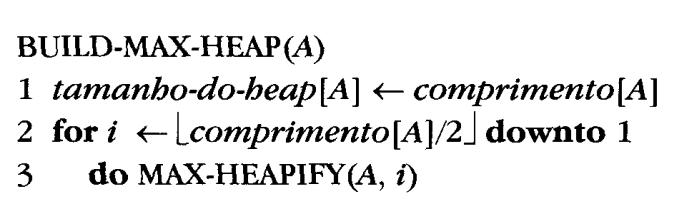
  <figcaption>Figura 3: Pseudocódigo BUILD-MAX-HEAP. Fonte: CORMEN et al. [1]</figcaption>
</figure>

### Análise da Complexidade
Podemos limitar superiormente o tempo de execução de BUILD-MAX-HEAP percebendo que a cada chamada a sub-rotina MAX-HEAPIFY custa tempo `O(lg n)`, e existem `O(n)` chamadas, concluindo que o tempo total de execução seria de `O(nlg n)`. Porém, esse limite superior não é assintoticamente restrito.

Podemos observar que o tempo para executar MAX-HEAPIFY sobre um nó varia com a altura do nó da árvore que em sua maioria é pequena. A partir da propriedade de que um _heap_ de `n` elementos possui altura `lg n` e no máximo **n / 2h + 1** nós de altura `h` e considerando que BUILD-MAX-HEAP é executado em todos os nós de cada altura, sua complexidade se modifica com a altura, partindo de 0 até sua altura máxima, ou seja, `lg n`. Portanto, a complexidade de BUILD-MAX-HEAP é o somatório das complexidades de cada altura da árvore de altura `h` multiplicado pela complexidade do MAX-HEAPIFY, que vamos caracterizar como tempo de execução em um nó de altura `h` como `O(h)`. Com isso, temos:

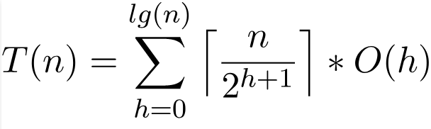

Utilizando as propriedades da notação Big-Oh para ignorar a função de teto e a constante **2h + 1 = 2h * 2** temos que:

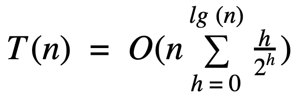

Desse forma, como estamos utilizando a notação Big-Oh, o limite superior do somatório pode ser aumentado até o infinito, ficando:

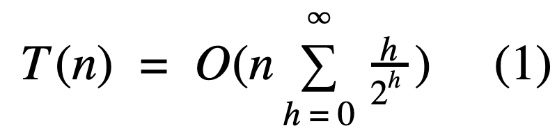
 
 

Para resolvermos a série presente em (1) tomaremos como base uma série representada em (2), sendo `x < 1`, 
efetuando algumas manipulações.
 
 
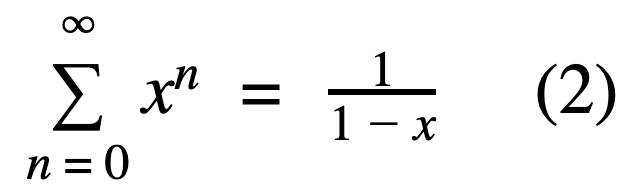
 

Derivando e multiplicando por `x` ambos os lados obtemos:
 
 
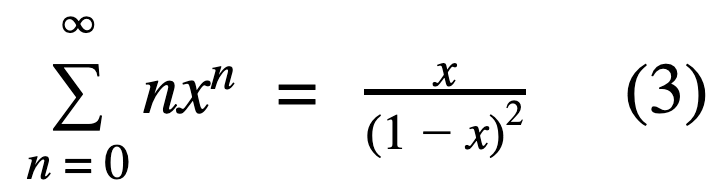
 

Substituindo-se `x = 1 / 2` em (3) temos que:
 
 
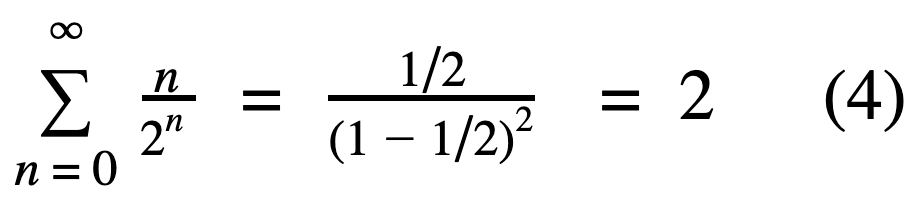
 

Colocando o resultado obtido em (4) de volta em (1) temos que:

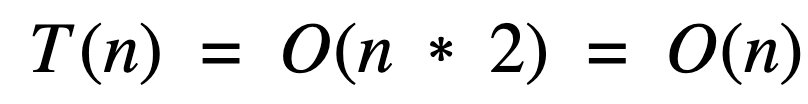
 
 

Com isso, concluimos que é possível construir um _heap_ máximo a partir de um arranjo não ordenado em tempo linear, ou seja, `O(n)`.

# Pseudocódigo Heapsort
<figure class="image">
  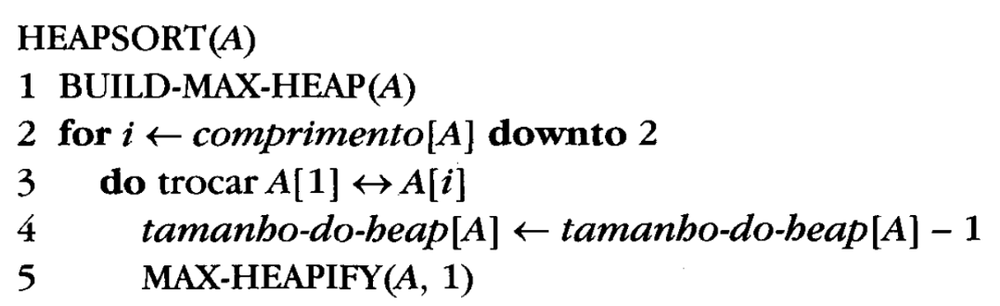
  <figcaption>Figura 4: Pseudocódigo Heapsort. Fonte: CORMEN et al. [1]</figcaption>
</figure>

# Análise da Complexidade Heapsort
A função HEAPSORT é inicia-se utilizando BUILD-MAX-HEAP no vetor de entrada para construir um _heap_ máximo. Após isso, o maior elemento do vetor está armazenado no primeiro elemento, ou seja, a raiz. Com isso, ele jaá pode ser colocado na posição dinal correta, trocando-se esse elemento pelo elemento da última posição válida do vetor. Após isso, o último elemento é "descartado" do _heap_, diminuindo o `tamanho-do-heap`. O processo de MAX-HEAPIFY é chamado na raiz para garantir que ele estará novamente em um estado de _heap_ máximo. Então, o HEAPSORT repete esse processo para o _heap_ de tamanho `n - 1`, descendo até um _heap_ de tamanho 2.

A partir disso, podemos afirmar que a complexidade do HEAPSORT é de `O(n*lg n)`, pois a chamada a subrotina BUILD-MAX-HEAP demora o tempo `O(n)`, e a cada uma das `n-1` chamadas a MAX-HEAPIFY demora o tempo `O(lg n)`.

 
 
 

### Referências
[1] CORMEN, Thomas H. et al. Algoritmos: teoria e prática 2. Campus. 2002

[2] GeeksForGeeks. HeapSort. Disponível em: https://www.geeksforgeeks.org/heap-sort/ . Acessado em: 25/02/2019
