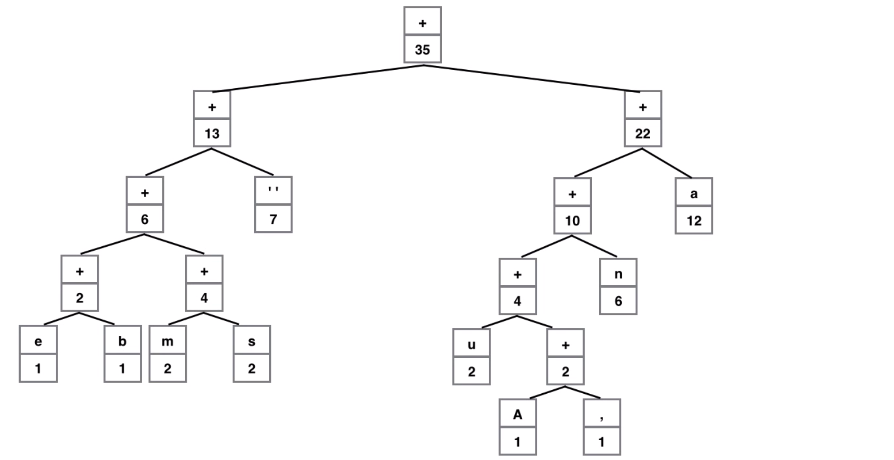

### Execução

```bash
$ make build
$ make run
```

# Algoritmos Gulosos

Um algoritmo guloso é um paradigma algorítmico que segue a heurística de resolução de problemas de fazer a escolha localmente ótima em cada estágio com a intenção de encontrar um ótimo global. Em muitos problemas, uma estratégia gulosa geralmente não produz uma solução ótima, mas mesmo assim uma heurística gananciosa pode produzir soluções ótimas localmente que se aproximam de uma solução globalmente ótima em um período de tempo razoável.

Podemos fazer qualquer escolha que parecer melhor no momento e depois resolver os subproblemas que surgem depois. A escolha feita por um algoritmo guloso pode depender de escolhas feitas até agora, mas não de escolhas futuras ou de todas as soluções para o subproblema. Iterativamente faz uma escolha gananciosa após a outra, reduzindo cada problema dado em um menor. Em outras palavras, um algoritmo guloso nunca reconsidera suas escolhas. Esta é a principal diferença da programação dinâmica, que é exaustiva e é garantida para encontrar a solução. Após cada estágio, a programação dinâmica toma decisões com base em todas as decisões tomadas no estágio anterior e pode reconsiderar o caminho algorítmico da etapa anterior para a solução.

## Algoritmo de Huffman

Criado por David A. Huffman, em 1952, durante seu doutorado no MIT, o algoritmo de Huffman consiste em uma técnica de compressão de dados sem perdas que usa a probabilidade de ocorrência dos símbolos no conjunto de dados a ser comprimido para determinar os códigos de comprimento variável para cada símbolo. Os códigos gerados para cada símbolo são binários, contendo apenas 0 e 1, e livres de prefixo, ou seja, nenhum código poderá ser prefixo de outro, evitando assim a ocorrência de ambiguidades na hora da decodificação do código.

Os códigos Huffman fornecem um método de codificação de dados com eficiência. Normalmente, quando os caracteres são codificados usando códigos padrão como `ASCII` ou `Unicode`, cada caractere é representado por uma palavra-chave de bits de comprimento fixo (por exemplo, 8 ou 16 bits por caractere). Códigos de comprimento fixo são populares, porque é muito fácil dividir uma string em caracteres individuais e acessar caracteres individuais e substrings por indexação direta. No entanto, os códigos de comprimento fixo podem não ser os mais eficientes na perspectiva de minimizar a quantidade total de dados.

### Árvore de Huffman

A Árvore de Huffman é uma árvore binária completa onde todos as folhas são símbolos do dicionário. Essa árvore é construída recursivamente a partir da remoção dos dois elementos menos frequentes da lista de frequências, que serão atrelados a um elemento intermediário, este que possuirá um peso equivalente à soma dos dois elementos retirados, esse novo elemento é inserido novamente na lista de frequências. Esse processo se repete até que reste apenas um item na lista, este que será a raíz da árvore. A partir dessa árvore é que será possível a codificação dos elementos.

#### Construção da árvore

Para montarmos a árvore de Huffman procedemos da seguinte maneira:

1. Crie um nó folha para cada caractere exclusivo e crie um heap mínimo de todos os nós folha (o Min Heap é usado como uma fila de prioridade. O valor do campo frequência é usado para comparar dois nós no heap mínimo. Inicialmente, o caractere menos frequente é raiz);
2. Extraia os dois nós de menor frequência do heap min;
3. Crie um nó interno com a frequência igual à soma das frequências dos dois nós extraídos. Faça o primeiro nó extraído como seu filho esquerdo e o outro nó extraído como seu filho direito. Adicione este nó ao heap min;
4. Repita os passos 2 e 3 até que reste apenas 1 nó. O nó restante representa o nó raiz e a árvore está montada.

Para o exemplo de construção da árvore abaixo, considere a frase a ser codificadada: **Ana ama sua nana, sua mana e banana**

_Heap mínimo de todos os nós folha_


<br /><br />

_Extraindo os dois nós de menor frequência e criando um nó interno com frequência igual à soma das frequências dos dois nós extraídos_


<br /><br />

_Adicionando de volta ao heap min_


<br /><br />

_Extraindo os dois nós de menor frequência e criando um nó interno com frequência igual à soma das frequências dos dois nós extraídos_


<br /><br />

_Adicionando de volta ao heap min_


<br /><br />

_Repetindo os passos 2 e 3 até que reste apenas 1 nó (raiz da árvore), temos a árvore de Huffman montada :_



### Codificação

Com a árvore montada, o processo de codificação é bastante simples:

1. Percorrer a Árvore de Huffman recursivamente;
2. Toda vez que for para a esquerda, concatenar um 0 ao código, e toda vez que for para a direita, concatenar um 1;

### Decodificação

1. Usar o código para navegar na árvore;

    - Quando encontrar um 0, andar para o filho da esquerda, caso encontre um 1, andar para o filho da direita;
    - Quando atingir uma folha, escolher aquele elemento;
    - Voltar para a raiz.

2. Repetir o processo 1 até que termine o código.

### Estratégia Gulosa

A estratégia gulosa no algoritmo de Huffman é feita durante a montagem da `Árvore de Huffman`.

A idéia é, em cada estágio da etapa de construção da árvore, atribuir códigos de comprimento variável a caracteres de entrada; os comprimentos dos códigos atribuídos são baseados nas freqüências dos caracteres correspondentes, com o objetivo de encontrar o menor código binário e livre de prefixo, garatindo a ausência de ambiguidades, tentando minimizar o código esperado para uma solução ótima na compressão do dado.

Criamos uma árvore binária e operamos nela de maneira ascendente, de modo que os caracteres de menor frequência fiquem o mais longe possível da raiz. Dessa forma, o caractere mais frequente obtém o menor código e o caractere menos frequente obtém o maior código e os nós caracteres sempre serāo nós folhas.

#### Referências

-   https://en.wikipedia.org/wiki/Greedy_algorithm
-   https://www.geeksforgeeks.org/huffman-coding-greedy-algo-3/
-   http://www.cs.umd.edu/class/fall2017/cmsc451-0101/Lects/lect06-greedy-huffman.pdf
